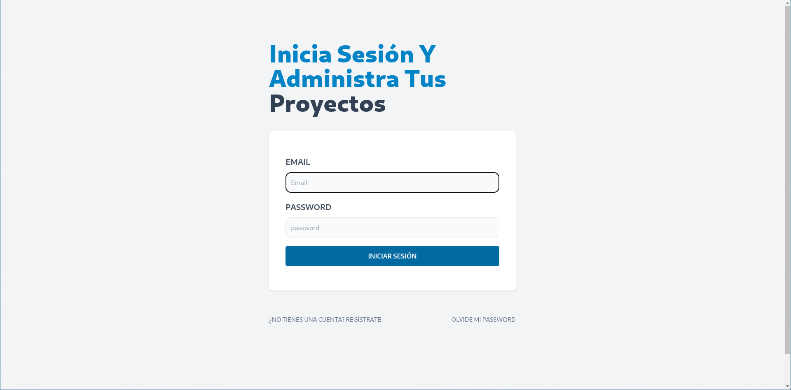
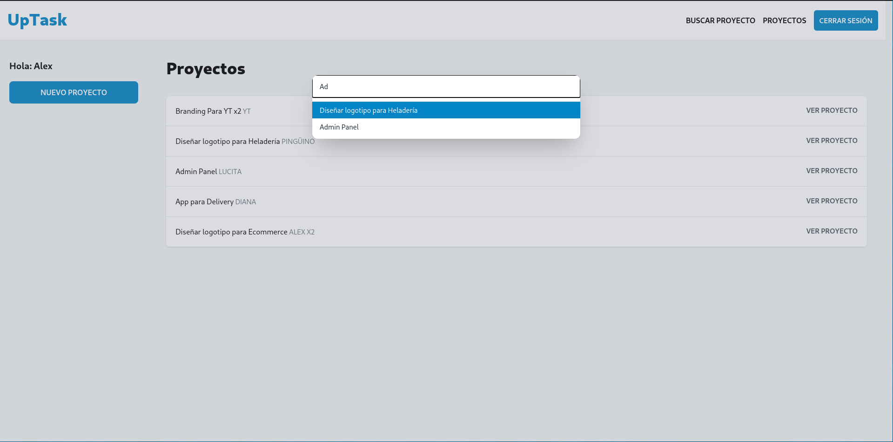
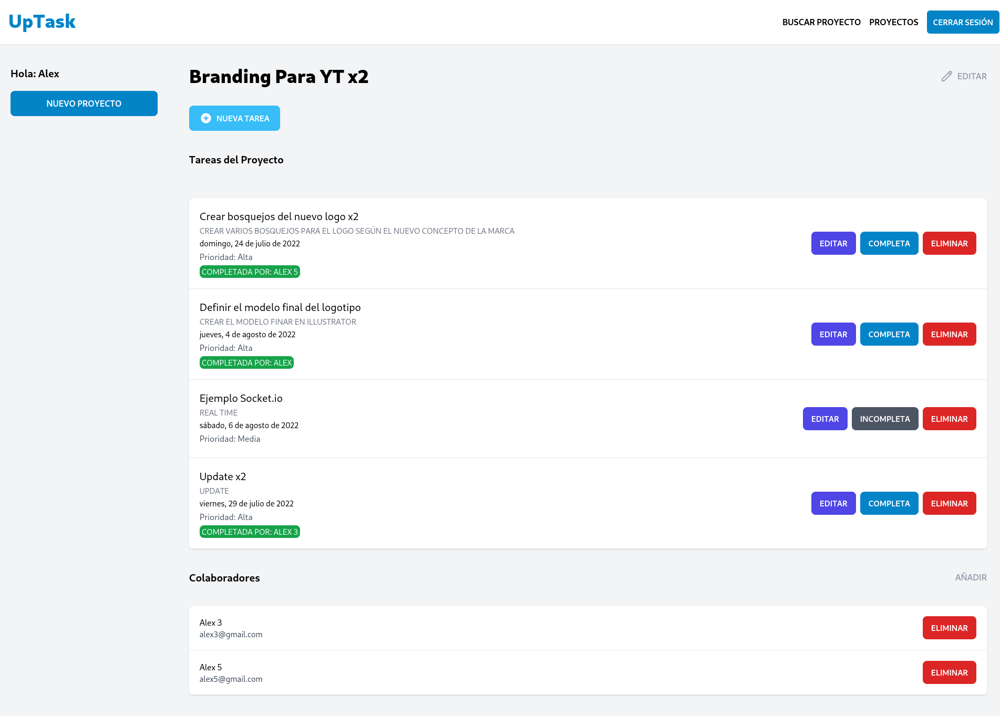
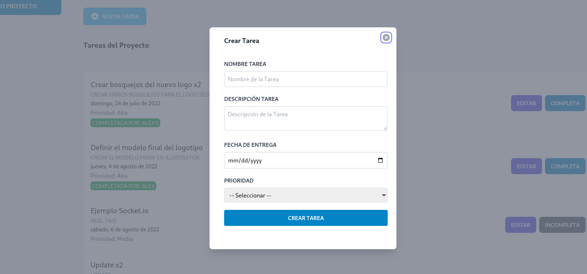
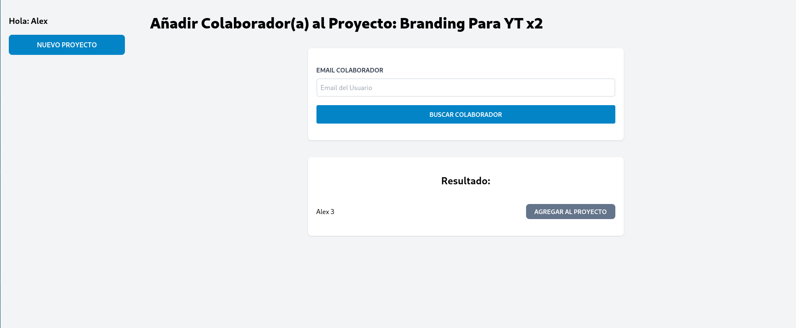

# UpTask - MERN & Socket.io - Front end

This is a full stak project developed with MERN Stack and Socket.io to give it a real time behavior to the CRUD operations of the tasks.

## Features included in this project

- React v18
- React Router DOM v6
- Context API
- Vite
- tailwindcss
- HeadlesUI
- Socket.io Client

## Running the app

```
# install dependencies with yarn:
yarn install

# or npm:
npm i


# run in dev mode:
yarn dev

# or:
npm run dev


# generate production build:
yarn build

# or:
npm run dev
```

# What are the functionalities of this project?

## Authentication

This project manages the tasks to be done in certain projects created by the user. Each project has the basic CRUD operations thanks to the API developed with Node.js in the back end. However, unlike the projects, the tasks of each project are managed in real time by the project creator and the project collaborators.

## State

The Global State of the app in the fronted is handled with Context API through an Authentication Provider and Projects Provider.

## Sign Up

The user must register with an e-mail address that has not been used before. Once the account has been created, the user must confirm the e-mail address entered by clicking on a link that will be sent immediately.
This link will contain a one-time use token which, after validation, will be removed from the database so that it cannot be used again.

## View demo

To see the real-time behavior you can log in with:

- User 1: `adrian@test.com` and password `test123`.
- User 2: `adrian2@test.com` and password `test123`.

[Demo](https://uptask-mern-io-adrianlx.netlify.app/)

## Backend

[GitHub](https://github.com/adrianAlx/uptask-mern-back)

## Screenshots






